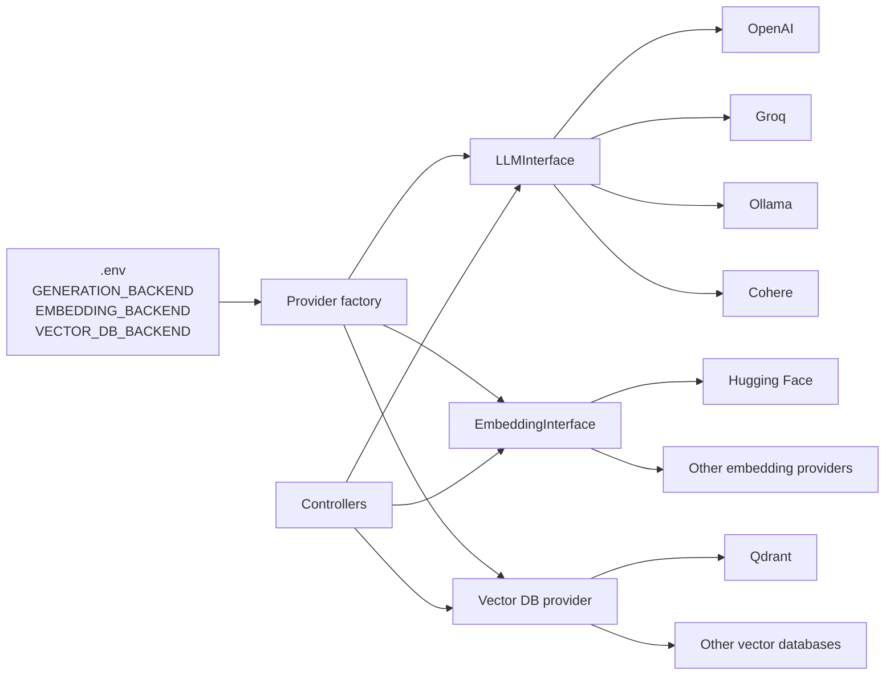
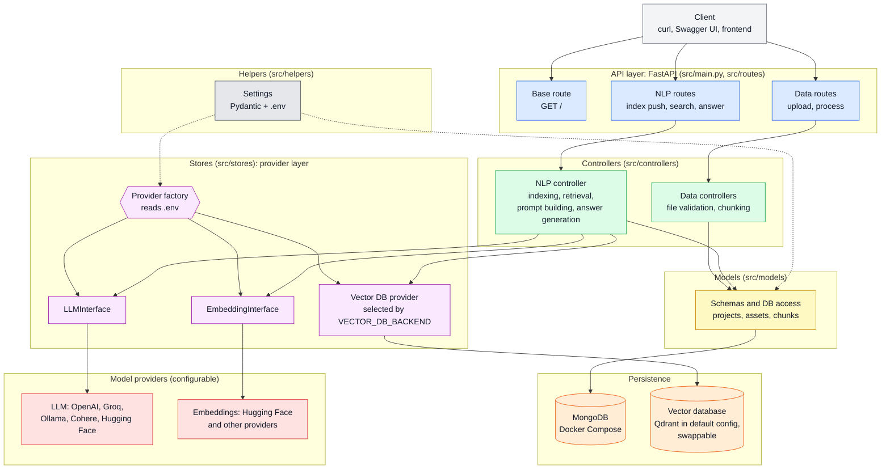
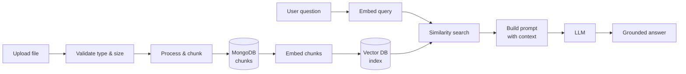

<div align="center">

# Assistant Doctor

**A document-aware medical assistant powered by Retrieval-Augmented Generation (RAG).**

Upload your clinical documents, index them, and ask questions in natural language, with answers grounded in your own sources.


-orange)


</div>

> **Medical disclaimer:** Assistant Doctor is intended for **informational and research support only**. It is **not** a substitute for professional medical advice, diagnosis, or treatment. Always consult a qualified healthcare professional.

> **Project status:** This is the **initial version (v0.1)** of the production-oriented rewrite and it is **still under active development**. Endpoints, configuration keys, and the folder structure may change between releases. See [Roadmap](#roadmap) for what is planned.

---

## Table of Contents

- [Overview](#overview)
- [Evolution from the original project](#evolution-from-the-original-project)
- [Architecture](#architecture)
- [Features](#features)
- [Tech Stack](#tech-stack)
- [Project Structure](#project-structure)
- [Getting Started](#getting-started)
- [Configuration](#configuration)
- [API Reference](#api-reference)
- [End-to-End Example](#end-to-end-example)
- [Production Notes](#production-notes)
- [Roadmap](#roadmap)
- [Contributing](#contributing)
- [License](#license)

---

## Overview

Healthcare teams constantly need fast access to patient guidance, protocols, clinical notes, and reference documents. Generic LLMs can answer questions, but they are not tied to *your* sources.

**Assistant Doctor** closes that gap. It ingests your documents, splits them into searchable chunks, indexes them in a vector database, and uses an LLM to generate answers **only from the retrieved context**, keeping responses traceable to the original material.

Each knowledge set lives in its own **project**, so multiple collections of documents stay isolated from one another.

## Evolution from the original project

This project is the next stage of **[Agenatic Assistant Doctor](https://github.com/alim9hamed/Agenatic_Assistant_Doctor/tree/main)** (referred to below as **v1**), a bilingual (Arabic / English) eye-disease chatbot. v1 proved the idea: a RAG chatbot over trusted medical websites, running as a Gradio app on Hugging Face Spaces, with a small Flask API on Render that forwards questions to it.

The goal of this version (**v2**) is to turn that proof of concept into a **production-oriented backend**: a properly layered application, with swappable model providers, persistent storage, and a real ingestion pipeline.

### What changed at a glance

| Area | v1: Agenatic Assistant Doctor | v2: Assistant Doctor (this project) |
|---|---|---|
| **Scope** | Eye-disease chatbot with a fixed knowledge base | General document-aware assistant; you supply the documents |
| **Where the RAG logic lives** | In a Hugging Face Space and a Colab notebook. The repo only holds a thin Flask proxy (`app.py`) | Inside this repository, as a structured application |
| **Code organization** | Single-file API | MVC-style layers: routes, controllers, models, stores, helpers |
| **Knowledge ingestion** | Landing pages of a hard-coded list of websites (WebMD, Mayo Clinic, MedlinePlus, Healthline, CDC), loaded with `WebBaseLoader` | File upload API (`.txt`, `.pdf`) with type and size validation |
| **Chunking** | Fixed: 150 characters, 30 overlap | Configurable per request (`chunk_size`, `overlap_size`) |
| **Retrieval depth** | Fixed top-2 chunks | Configurable per request (`limit`) |
| **LLM** | One provider: Groq (`llama-4-scout-17b-16e-instruct`) | Multiple providers through an `LLMInterface` and a factory (OpenAI, Groq, Ollama, Cohere, Hugging Face) |
| **Embeddings** | One model: `all-MiniLM-L6-v2` | Multiple providers through an `EmbeddingInterface` and a factory |
| **Vector database** | ChromaDB (local `chroma_db` directory) | Pluggable, selected through configuration (`VECTOR_DB_BACKEND`); Qdrant in the default configuration |
| **Persistent storage** | Vector store only | MongoDB for projects, files, and chunks, plus the vector database for embeddings |
| **Multi-tenancy** | Single knowledge base | Project-based isolation: one namespace per project |
| **Configuration** | Values set in the notebook / Space | Environment-based settings (`.env`) validated with Pydantic |
| **API surface** | One endpoint: `POST /predict` | Versioned `/api/v1` endpoints for upload, process, index, search, and answer, plus Swagger UI |
| **Runtime dependency** | API only works while the Hugging Face Space is awake | Self-contained service; depends only on your database and the provider you configure |
| **Local infrastructure** | None | Docker Compose for MongoDB |

### Where the real work went

**1. Separation of concerns with an MVC-style structure.**
In v1 the API, the retrieval logic, and the model calls were not separated inside the repository. In v2 each layer has one job:

| Layer | Folder | Responsibility |
|---|---|---|
| Routes (entry layer) | `src/routes/` | Define HTTP endpoints, validate requests, and delegate. No business logic. |
| Controllers | `src/controllers/` | Orchestrate the logic: file handling, chunking, indexing, retrieval, prompt building, answer generation. |
| Models | `src/models/` | Data schemas and MongoDB access for projects, assets, and chunks. |
| Stores | `src/stores/` | Provider layer: LLM, embedding, and vector database implementations. |
| Helpers | `src/helpers/` | Settings and shared utilities. |

The practical benefit is that a change to one concern (for example swapping the database or the LLM) does not ripple through the rest of the code.

**2. Provider flexibility through interfaces and a factory.**
v1 was tied to a single LLM provider, a single embedding model, and a single vector store. v2 introduces:

- an **`LLMInterface`** that defines what any text-generation backend must provide
- an **`EmbeddingInterface`** that defines what any embedding backend must provide
- a **provider factory** that reads the configuration and returns the right implementation
- a **configurable vector database backend**, selected with `VECTOR_DB_BACKEND`, so you are not locked into Qdrant



Controllers only ever talk to the interfaces, never to a specific vendor. Switching provider is a configuration change, and adding a new one means implementing the interface and registering it in the factory, with no changes to the controllers or routes. Generation, embeddings, and the vector database are configured independently, so you can, for example, generate with Groq, embed with a Hugging Face model, and store vectors in the database of your choice, or run generation and embeddings locally with Ollama.

**3. Persistence in two layers.**
v1 kept only a vector store. v2 stores everything that matters:

- **MongoDB** holds projects, uploaded file records, and the text chunks. Chunks are saved as the source of truth, so the vector index can be rebuilt from MongoDB without re-uploading or re-processing files.
- **The vector database** holds chunk embeddings for similarity search. It is a pluggable backend chosen in configuration; the default configuration uses Qdrant.

**4. A real ingestion pipeline.**
Instead of scraping a fixed set of web pages, documents now enter through an API: upload, validate (type and size), chunk (with configurable size and overlap), store, then index. This is what makes the system usable for any team's own protocols and documents, not only one medical topic.

### What is not carried over yet

v1 included product behaviors that are specific to its eye-disease chatbot, such as automatic Arabic / English language detection with RTL/LTR formatting and an ophthalmologist persona prompt. Porting the bilingual behavior to the new architecture is on the [Roadmap](#roadmap).

## Architecture

### Component diagram

How the layers fit together and which component talks to which. Requests flow top to bottom: routes delegate to controllers, controllers use models for persistence and stores for AI providers, and nothing in the upper layers knows which vendor sits at the bottom.



### Data flow

The RAG pipeline from document upload to grounded answer.



1. **Upload** a file to a project
2. **Process** the file and split it into chunks
3. **Store** chunks in MongoDB
4. **Index** chunk embeddings in the vector database
5. **Search** for the chunks most relevant to a question
6. **Generate** an answer grounded in the retrieved context

## Features

- **Document ingestion:** upload `.txt` and `.pdf` files, with file type and size validation before processing
- **Configurable chunking:** control chunk size and overlap per processing run
- **MongoDB storage:** projects, files, and chunks are persisted
- **Semantic search:** embed chunks and retrieve the most relevant ones by similarity
- **Grounded answers:** the LLM answers using only the retrieved context
- **Pluggable providers:** choose your LLM and embedding backend independently (OpenAI, Groq, Ollama, Cohere, Hugging Face)
- **Project isolation:** separate knowledge bases for separate use cases
- **Docker-ready database:** run MongoDB locally with a single command

## Tech Stack

| Layer | Technology |
|---|---|
| Language | Python 3.10+ |
| API framework | FastAPI |
| Database | MongoDB |
| Vector database | Pluggable backend (Qdrant in the default configuration) |
| Orchestration | LangChain |
| LLM / embedding providers | OpenAI, Groq, Ollama, Cohere, Hugging Face |
| Configuration | Pydantic Settings (`.env`) |
| Containerization | Docker Compose (MongoDB) |

## Project Structure

```text
.
├── docker/
│   ├── .env.example          # MongoDB credentials template
│   ├── docker-compose.yml    # MongoDB service
│   └── .gitignore
├── src/
│   ├── .env.example          # Application settings template
│   ├── main.py               # FastAPI entry point
│   ├── requirements.txt
│   ├── routes/               # HTTP endpoints (entry layer)
│   ├── controllers/          # Business logic
│   ├── models/               # Schemas and MongoDB access
│   ├── stores/               # LLM, embedding, and vector DB providers
│   └── helpers/              # Settings and utilities
├── LICENSE
├── README.md
└── .gitignore
```

## Getting Started

### Prerequisites

- Python **3.10** or newer
- A running **MongoDB** instance (local or via Docker, see below)
- An API key for your chosen generation / embedding backend (e.g. Groq, OpenAI, Hugging Face), unless you run models locally with Ollama
- A vector database backend, configured in `.env` (the default configuration uses Qdrant)

### 1. Clone the repository

```bash
git clone -b production-v2 https://github.com/alim9hamed/Agenatic_Assistant_Doctor.git
cd Agenatic_Assistant_Doctor
```

### 2. Start MongoDB with Docker

```bash
cd docker
cp .env.example .env
```

Edit `docker/.env`:

```env
MONGO_INITDB_ROOT_USERNAME=admin
MONGO_INITDB_ROOT_PASSWORD=supersecret
```

Then start the database:

```bash
docker compose up -d
cd ..
```

### 3. Set up the Python environment

<details open>
<summary><b>Conda (recommended)</b></summary>

```bash
conda create -n assistant-doctor python=3.10
conda activate assistant-doctor
cd src
pip install -r requirements.txt
cp .env.example .env
```

On Windows PowerShell, replace the last line with:

```powershell
Copy-Item .env.example .env
```

</details>

<details>
<summary><b>Standard virtual environment</b></summary>

```bash
cd src
python -m venv .venv
source .venv/bin/activate
pip install -r requirements.txt
cp .env.example .env
```

</details>

### 4. Configure the application

Edit `src/.env` (see [Configuration](#configuration)).

### 5. Run the server

From the `src` directory:

```bash
uvicorn main:app --reload --host 0.0.0.0 --port 5000
```

| Resource | URL |
|---|---|
| API root | http://localhost:5000 |
| Swagger UI | http://localhost:5000/docs |

## Configuration

All settings are loaded from `src/.env`.

```env
APP_NAME="assistant-doctor"
APP_VERSION="0.1"

FILE_ALLOWED_TYPES=["text/plain", "application/pdf"]
FILE_MAX_SIZE=10
FILE_DEFAULT_CHUNK_SIZE=512000

MONGODB_URL="mongodb://localhost:27017"
MONGODB_DATABASE="assistant_doctor"

GENERATION_BACKEND="GROQ"
EMBEDDING_BACKEND="HUGGINGFACE"

GROQ_API_KEY="your_groq_key"
HUGGINGFACE_API_KEY="your_hf_key"

GENERATION_MODEL_ID="llama-3.1-70b-versatile"
EMBEDDING_MODEL_ID="sentence-transformers/all-MiniLM-L6-v2"
EMBEDDING_MODEL_SIZE=384

VECTOR_DB_BACKEND="QDRANT"
VECTOR_DB_PATH="qdrant_db"
VECTOR_DB_DISTANCE_METHOD="cosine"
```

| Variable | Description |
|---|---|
| `FILE_ALLOWED_TYPES` | MIME types accepted on upload |
| `FILE_MAX_SIZE` | Maximum upload size (MB) |
| `FILE_DEFAULT_CHUNK_SIZE` | Default chunk size used when reading files |
| `MONGODB_URL` / `MONGODB_DATABASE` | MongoDB connection string and database name |
| `GENERATION_BACKEND` | LLM provider used to generate answers (resolved by the provider factory) |
| `EMBEDDING_BACKEND` | Provider used to create embeddings (resolved by the provider factory) |
| `*_API_KEY` | API key for each provider you use |
| `GENERATION_MODEL_ID` | Model used for answer generation |
| `EMBEDDING_MODEL_ID` | Model used for embeddings |
| `EMBEDDING_MODEL_SIZE` | Embedding vector dimension (must match the embedding model) |
| `VECTOR_DB_BACKEND` | Vector database provider to use. `QDRANT` is used in the example above; other supported backends can be selected here without code changes |
| `VECTOR_DB_PATH` | Local storage path for the vector database (used by local backends) |
| `VECTOR_DB_DISTANCE_METHOD` | Similarity metric (e.g. `cosine`) |

> **Note:** `EMBEDDING_MODEL_SIZE` must match the output dimension of your chosen embedding model, otherwise indexing will fail. If you change the embedding model, re-index your project with `do_reset` set to `1`.

## API Reference

Base URL: `http://localhost:5000/api/v1`

| Method | Endpoint | Purpose |
|---|---|---|
| `GET` | `/` | Health check |
| `POST` | `/data/upload/{project_id}` | Upload a file to a project |
| `POST` | `/data/process/{project_id}` | Chunk uploaded files |
| `POST` | `/nlp/index/push/{project_id}` | Embed chunks and push to the vector DB |
| `POST` | `/nlp/index/search/{project_id}` | Semantic search over indexed chunks |
| `POST` | `/nlp/index/answer/{project_id}` | Answer a question using RAG |

### Health check

```bash
curl http://localhost:5000/api/v1/
```

### Upload a file

```bash
curl -X POST "http://localhost:5000/api/v1/data/upload/my-project" \
  -F "file=@/path/to/document.pdf"
```

### Process uploaded files

```bash
curl -X POST "http://localhost:5000/api/v1/data/process/my-project" \
  -H "Content-Type: application/json" \
  -d '{
    "chunk_size": 500,
    "overlap_size": 50,
    "file_id": null,
    "do_reset": 0
  }'
```

| Field | Description |
|---|---|
| `chunk_size` | Size of each chunk |
| `overlap_size` | Overlap between consecutive chunks |
| `file_id` | Process a single file, or `null` to process all files in the project |
| `do_reset` | `1` to clear existing chunks before processing, `0` to keep them |

### Push chunks to the vector database

```bash
curl -X POST "http://localhost:5000/api/v1/nlp/index/push/my-project" \
  -H "Content-Type: application/json" \
  -d '{ "do_reset": 0 }'
```

### Search indexed content

```bash
curl -X POST "http://localhost:5000/api/v1/nlp/index/search/my-project" \
  -H "Content-Type: application/json" \
  -d '{
    "text": "What does the guideline say about patient triage?",
    "limit": 5
  }'
```

### Ask a question (RAG)

```bash
curl -X POST "http://localhost:5000/api/v1/nlp/index/answer/my-project" \
  -H "Content-Type: application/json" \
  -d '{
    "text": "Summarize the recommended follow-up steps.",
    "limit": 5
  }'
```

## End-to-End Example

```bash
# 1. Upload a document
curl -X POST "http://localhost:5000/api/v1/data/upload/demo" \
  -F "file=@./triage-guidelines.pdf"

# 2. Chunk it
curl -X POST "http://localhost:5000/api/v1/data/process/demo" \
  -H "Content-Type: application/json" \
  -d '{"chunk_size": 500, "overlap_size": 50, "file_id": null, "do_reset": 0}'

# 3. Index the chunks
curl -X POST "http://localhost:5000/api/v1/nlp/index/push/demo" \
  -H "Content-Type: application/json" \
  -d '{"do_reset": 0}'

# 4. Ask a question
curl -X POST "http://localhost:5000/api/v1/nlp/index/answer/demo" \
  -H "Content-Type: application/json" \
  -d '{"text": "What is the recommended triage order?", "limit": 5}'
```

## Production Notes

This version is built to be production-oriented (layered code, persistent storage, configurable providers), but it is an early release. Before exposing it publicly:

- Use proper **secret management** for API keys and database credentials; never commit `.env` files
- Add **authentication and authorization**; the API is currently open
- Restrict **file types and sizes** to match your deployment needs
- **Evaluate** embedding quality and prompts on your own domain data
- Make sure your data sources are **legally and ethically** valid for use in AI workflows
- Handle patient data in line with applicable regulations (e.g. HIPAA, GDPR)
- Add **monitoring and audit logging**

## Roadmap

- [ ] Authentication and role-based access
- [ ] Port bilingual (Arabic / English) language detection and response formatting from v1
- [ ] Domain-specific prompt templates (for example the ophthalmologist persona from v1)
- [ ] Source citations in generated answers
- [ ] Support for more document formats (e.g. DOCX)
- [ ] Tests and an evaluation suite for retrieval and answer quality
- [ ] Containerize the full stack (API + MongoDB + vector DB)
- [ ] Web UI for upload and chat

## Contributing

Contributions are welcome.

1. Fork the repository
2. Create a feature branch: `git checkout -b feature/my-feature`
3. Commit your changes: `git commit -m "Add my feature"`
4. Push the branch: `git push origin feature/my-feature`
5. Open a Pull Request

## License

Licensed under the **Apache License, Version 2.0**. See [LICENSE](LICENSE) for details.